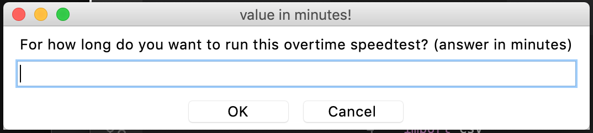
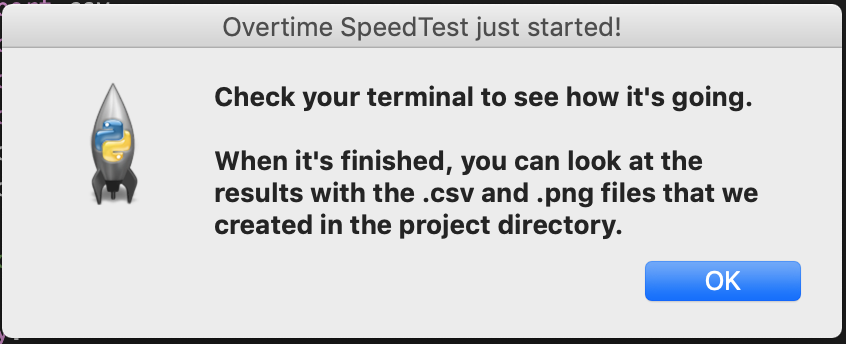
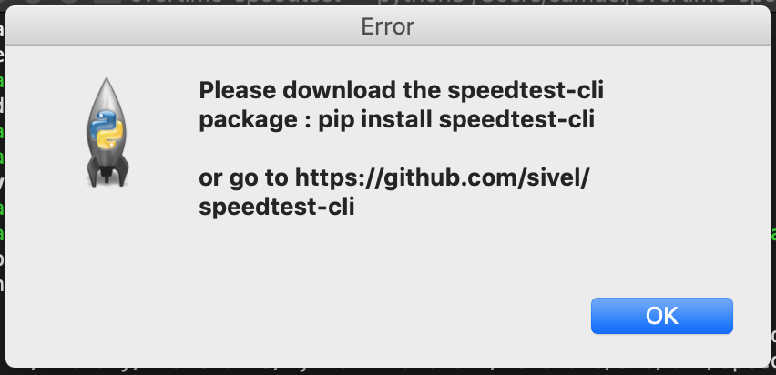

# :dash: overtime-speedtest :dash:

## Project Overview 
The goal of this project is to run a sequence of internet speedtests over time. The user will be able to decide how long they want the program to run for and how frequently they want to run a speedtest. For example, one could choose to run the program for 5 hours with speedtests every 10 minutes. At the end of the run, the user will have access to the raw data and graphs of the data.   
While the program is running, the user can look at the progress being made and the values from each completed test in their terminal. 

I was often wondering how much my internet speed could fluctuate during the day which led me to write this code. 

## Design
This project does not contain a significant amount of code but uses Python quite comprehensively, including all the following features :
- **Object Oriented Programming** : All the calculations for a single speedtest are encapsulated in an object defined by the GetSpeeds class in the `single_test.py` file.
- **Graphical User Interface** : Python's built in library Tkinter is used to prompt the user for overall duration and frequency. It is also used to show error messages if the user is missing some libraries and telling them how to install those libraries to get the program up and running. 
- **Plotting** : The data collected from all the speedtests is plotted (and stored in .png files) using Python's famous matplotlib library making it easy to see the speed fluctuations. 
- **File managment** : If all the data has been collected properly, two directories are created in the project directory: 
    - `/raw-data` : contains the raw data stored in .csv files. 
    - `/result-graphs` : contains the graphs of the data plotted with matplotlib.
- **Python Function Decorator** : The halo library with its function decorators is used to created loading spinners that are shown while a test is running in the user's terminal which gives more information to the user about what is currently happening. 

The code has been written to be easily understood and the program has been made to make the user experience as easy as possible by pointing at anything that could go wrong (particularly missing packages). 

## How to run it
1. Download the `overtime_test.py` and `single_test.py` files from this repository (making sure they end up in the same directory).
2. Run `python3 overtime_test.py` from a command line.
3. If the program asks to download additional libraries, please do so. 
4. :warning: **IMPORTANT** : Check the command line after one test has been run to see if there is an SLL certificate error. If so, some text will be printed to the command line to explain what to do. 
5. Wait until the program ends and check out the results in the `/raw-data` and `/result-graphs` directories.

## Sample results provided in this repository
Have a look at the `/raw-data` and `/result-graphs` directories in this repository to see what the final data would look like. 

## Snapshots
Here are snapshots of what it would look like when the program is run. 

